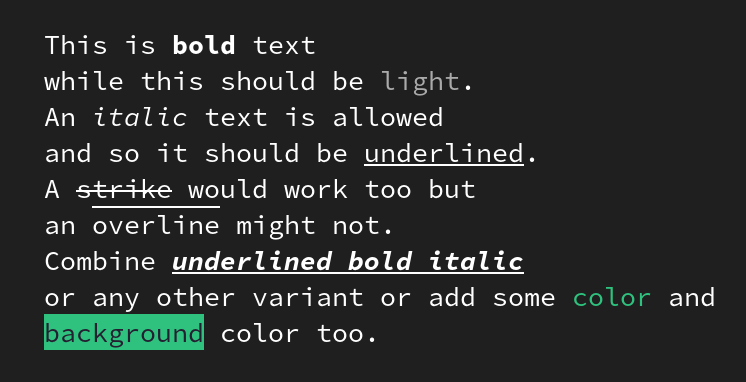

# console-strings

[](https://coveralls.io/github/WebReflection/console-strings?branch=main) <sup>**Social Media Photo by [Dominik Scythe](https://unsplash.com/@drscythe) on [Unsplash](https://unsplash.com/)**</sup>


A dual module that can be used via `import`, `require`, or directly via `https://esm.run/console-strings`, to automatically wrap `\x1b[...` escape chars around strings in a terminal or devtools compatible way.

```js
import {
  bold,       // show bold text
  light,      // show a lighter text
  italic,     // show italic text
  underline,  // show underlined text
  strike,     // show a strike-through text
  overline,   // show an overline (not in devtools)
  foreground, // use a specific text color
  background, // use a specific background color
  reset,      // reset any broken output (not needed but handy)
} from 'console-strings';

// ⚠️ needed only for x-browser compatibility
// not needed at all in Bun, NodeJS or Chrome/ium browsers
import * as console from 'console-strings/browser';
// exported: error, info, log, warn

console.log(`
  This is ${bold('bold')} text
  while this should be ${light('light')}.
  An ${italic('italic')} text is allowed
  and so it should be ${underline('underlined')}.
  A ${strike('strike')} would work too but
  an ${overline('overline')} might not.
  Combine ${underline(bold(italic('underlined bold italic')))}
  or any other variant or add some ${fg('color', 32)} and
  ${background(foreground('background', 30), 42)} color too. ${reset()}
`);
```



### Colors

All colors compatible with devtools are described [in here](https://developer.chrome.com/docs/devtools/console/format-style) and this is a summary:

| Name           | Foreground | Background | Light theme | Dark theme  |
| :------------- | :--------- | :--------- | :---------- | :---------- |
| Black          | `30`       | `40`       | #000000     | #000000     |
| Red            | `31`       | `41`       | #AA0000     | #ED4E4C     |
| Green          | `32`       | `42`       | #00AA00     | #01C800     |
| Yellow         | `33`       | `43`       | #AA5500     | #D2C057     |
| Blue           | `34`       | `44`       | #0000AA     | #2774F0     |
| Magenta        | `35`       | `45`       | #AA00AA     | #A142F4     |
| Cyan           | `36`       | `46`       | #00AAAA     | #12B5CB     |
| White          | `37`       | `47`       | #AAAAAA     | #CFD0D0     |
| Bright Black   | `90`       | `100`      | #555555     | #898989     |
| Bright Red     | `91`       | `101`      | #FF5555     | #F28B82     |
| Bright Green   | `92`       | `102`      | #55FF55     | #01C801     |
| Bright Yellow  | `93`       | `103`      | #FFFF55     | #DDFB55     |
| Bright Blue    | `94`       | `104`      | #5555FF     | #669DF6     |
| Bright Magenta | `95`       | `105`      | #FF55FF     | #D670D6     |
| Bright Cyan    | `96`       | `106`      | #55FFFF     | #84F0FF     |
| Bright White   | `97`       | `107`      | #FFFFFF     | #FFFFFF     |

If a foreground value for a `background(content, value)` is passed along, or vice-versa, a `⚠` char would prefix the error without throwing while outputting.

The `browser` variant color is chosen after a one-off `matchMedia('(prefers-color-scheme:dark)')` check.
